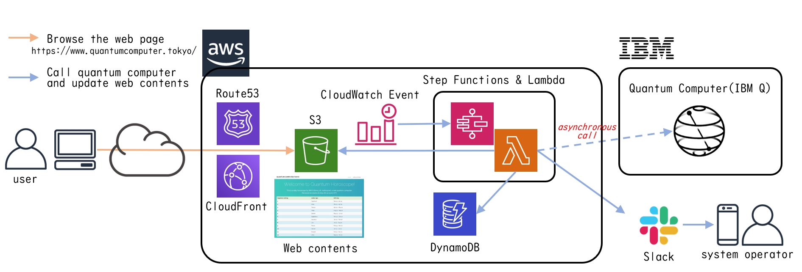
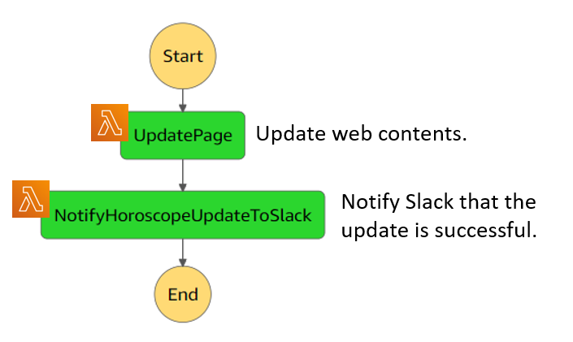
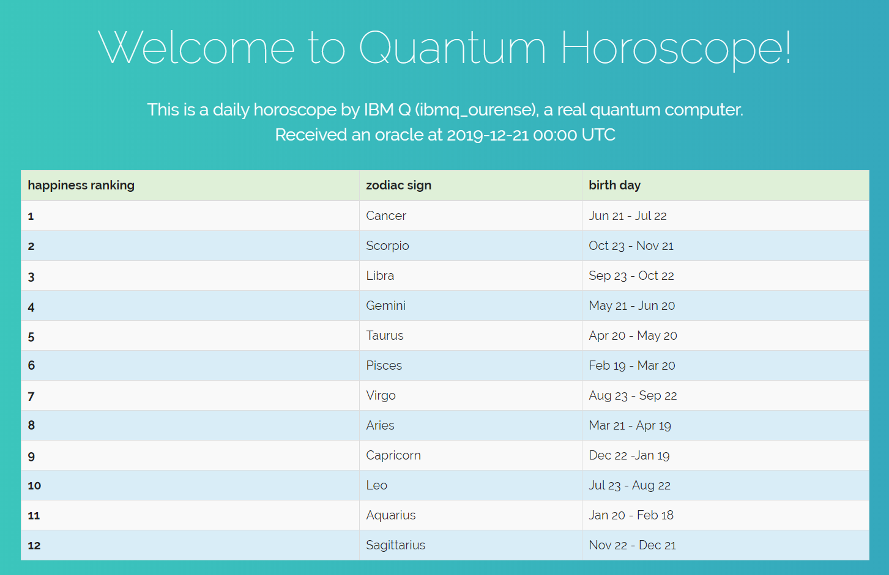

# What is **qctokyo**?

**qctokyo**, shortened form of "Quantum Computer.Tokyo" and pronounced "q-c-tokyo", is a collection of serverless quantum computer applications.  
This is an open source project and licensed under Apache 2.0.  
You can develop serverless quantum computer applications based on **qctokyo**.

This project is actually running on https://www.quantumcomputer.tokyo/ .

The purpose of **qctokyo** as an open source project is to provide templates for cloud quantum computer applications with the following properties:
- quickly development
- high available, scalable and performing applications
- low-priced operating costs

# Architecture of **qctokyo**

**qctokyo** is a collection of serverless applications running on AWS.  
**qctokyo** calls the quantum computer from Step Functions & Lambda.  
Web contents are placed in S3 and users browse via Route53 and CloudFront.  
Therefore, there is no need for always-running servers.  
**qctokyo** can be operated for $1 per month.

The architecture of **qctokyo** is as follows:

Step Functions & Lambda of **qctokyo** consist of two parts.  
In the first part, it calls IBM's quantum computer and stores results in DynamoDB.  
In the second part, it gets results from DynamoDB and updates web contents.  

the design of the first part of Step Functions & Lambda is as follows:  

the second part is as follows:  

# What applications does **qctokyo** have?

Now **qctokyo** has one application named "Quantum Horoscope".  

## Quantum Horoscope

Quantum Horoscope is, as the name suggests, an application of horoscope.  
Every day at 0:00 (UTC), it calls a quantum computer to get random numbers.  
It ranks the zodiac based on the random numbers.  
Finally, it updates the rankings on the web page.  

You can see the latest rankings here.  
https://www.quantumcomputer.tokyo/horoscope.html

# Documents

* How to install **qctokyo** and related softwares  
  see [HowToInstall.md](docs/HowToInstall.md).

* How to make Qiskit as AWS Lambda layers  
  see [HowToMakeQiskitLayer.md](docs/HowToMakeQiskitLayer.md).

* How to deploy **qctokyo**  
  see [HowToDeploy.md](docs/HowToDeploy.md).

* How to remove(undeploy) **qctokyo**  
  see [HowToRemove.md](docs/HowToRemove.md).

